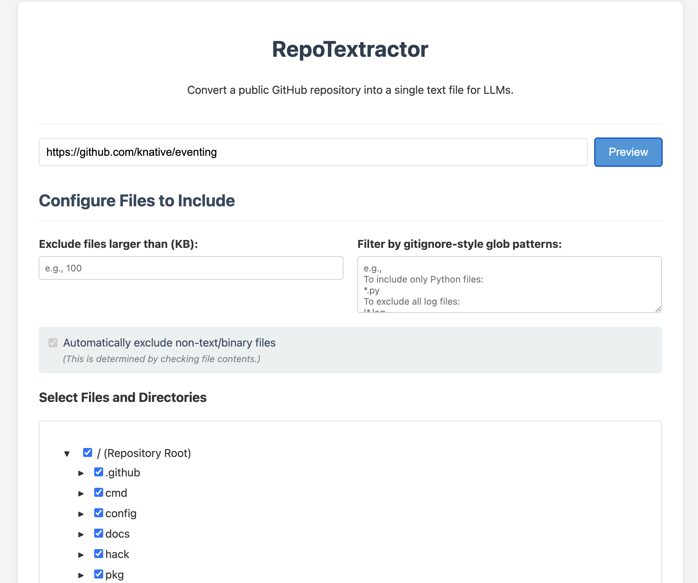
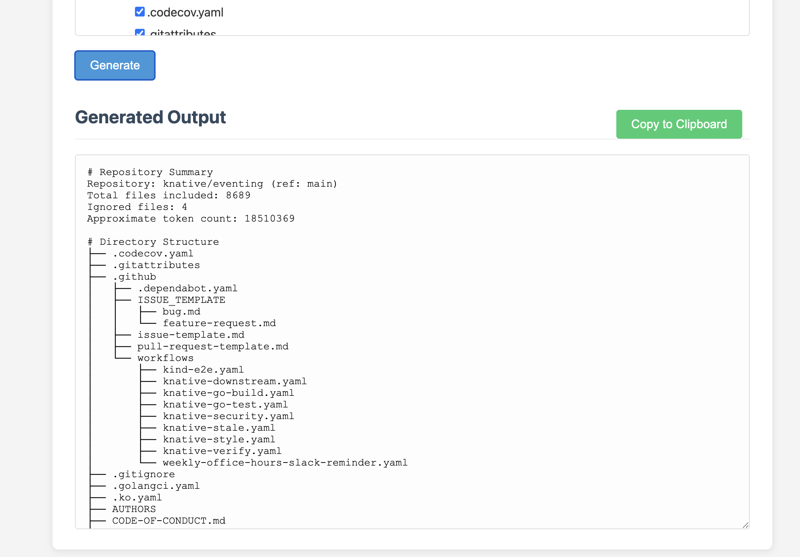

# RepoTextractor

RepoTextractor is a web application designed to convert public GitHub repositories into a single, well-formatted text file. As an alternative to services like **uithub.com** and **gitingest.com**, this tool provides an interactive interface to generate a clean, context-rich output optimized for ingestion by Large Language Models (LLMs).

This allows an LLM to analyze or understand an entire codebase with proper context, based on a finely-tuned selection of files.

## Screenshots

**1. Interactive Filtering Interface:**


**2. Formatted Text Output:**


## Features

-   **Flexible URL Input**: Fetches code from various public GitHub URLs, including:
    -   Repository main branches (`.../owner/repo`)
    -   Specific branches (`.../tree/branch-name`)
    -   Tags (`.../tree/tag-name`)
    -   Specific commits (`.../commit/hash`)
    -   Pull requests (`.../pull/123`)
-   **Interactive File Tree**: After previewing a repository, you get a full, interactive directory tree. You can expand/collapse directories and select or deselect any file or folder.
-   **Advanced Filtering Options**:
    -   **File Size**: Exclude files larger than a specified size (in KB).
    -   **Glob Patterns**: Include or exclude files using `.gitignore`-style patterns (e.g., `*.py`, `!dist/*`).
    -   **Binary File Detection**: Automatically detects and excludes non-text (binary) files to keep the output clean for LLMs.
-   **Optimized LLM Output**: The generated text file includes:
    -   A summary of the repository and the filters applied.
    -   A directory tree structure of the included files.
    -   The full content of each file, clearly demarcated.

## Technology Stack

-   **Backend**: Python with **Flask**
-   **Frontend**: Vanilla JavaScript and **jQuery** for DOM manipulation and AJAX.
-   **Styling**: Plain CSS (no frameworks).

## Setup and Installation

Follow these steps to run the application on your local machine.

### 1. Prerequisites

-   Python 3.8+
-   `pip` and `venv`
-   [pyenv](https://github.com/pyenv/pyenv) (Recommended for managing Python versions on macOS/Linux)

### 2. Clone the Repository

```bash
git clone https://github.com/your-username/repo-textractor.git
cd repo-textractor
```

### 3. Set Up Environment & Install (Recommended Method)

These instructions use `pyenv` to ensure you are using a specific, consistent Python version.

```bash
# Install and set the local Python version for this project
pyenv install 3.11.9
pyenv local 3.11.9

# Create and activate a virtual environment using the pyenv-managed python
# 'pyenv which python' ensures you use the pyenv-controlled python executable
$(pyenv which python) -m venv venv
source venv/bin/activate

# Install the project dependencies from the requirements file
pip install -r requirements.txt
```

**Alternative Setup (without `pyenv`):**

If you are not using `pyenv`, you can create the virtual environment with your system's Python (ensure it's version 3.8+):

```bash
# On macOS/Linux:
python3 -m venv venv
source venv/bin/activate

# On Windows:
python -m venv venv
.\venv\Scripts\activate

# Install dependencies
pip install -r requirements.txt
```

### 4. (Recommended) Set GitHub API Token

To avoid being rate-limited by the GitHub API, you should create a [Personal Access Token (PAT)](https://docs.github.com/en/authentication/keeping-your-account-and-data-secure/managing-your-personal-access-tokens) with `public_repo` access.

Then, set it as an environment variable:

**On macOS/Linux:**

```bash
export GITHUB_TOKEN="your_personal_access_token_here"
```

**On Windows (Command Prompt):**

```bash
set GITHUB_TOKEN="your_personal_access_token_here"
```

**On Windows (PowerShell):**

```powershell
$env:GITHUB_TOKEN="your_personal_access_token_here"
```

The application will automatically use this token if it's available.

### 5. Run the Application

```bash
flask run --port 15001
```

The application will now be running at `http://127.0.0.1:15001`.

## Usage

1.  Open your web browser and navigate to `http://127.0.0.1:15001`.
2.  Enter the URL of any public GitHub repository into the input field.
3.  Click the **Preview** button.
4.  Wait for the file tree to be fetched and displayed.
5.  Use the filter controls to refine your selection:
    -   Set a maximum file size.
    -   Add glob patterns for inclusion/exclusion.
    -   Select/deselect files and directories in the interactive tree.
6.  Click the **Generate** button.
7.  The backend will process the repository based on your filters. This may take a moment for large repositories.
8.  The final, concatenated text output will appear in the text area at the bottom.
9.  Use the **Copy to Clipboard** button to easily copy the entire output.
